# react-native-c5


[](https://codecov.io/gh/C5m7b4/react-native-c5)
[](https://dl.circleci.com/status-badge/redirect/gh/C5m7b4/react-native-c5/tree/main)

a  small library to host charts

## Installation

```sh
npm install react-native-c5
```

## Basic Chart

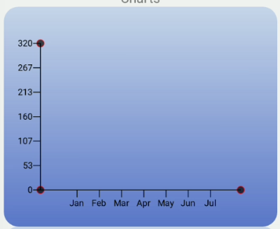
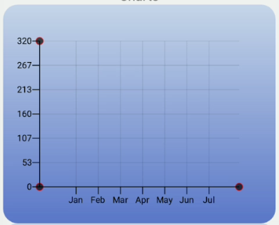

## Line Chart

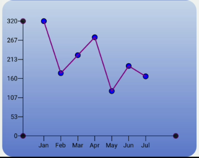

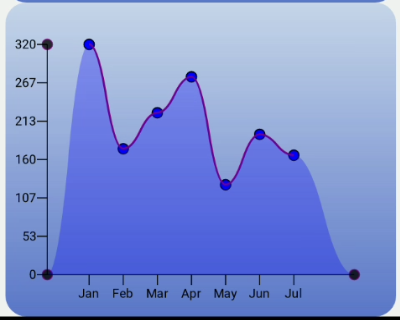
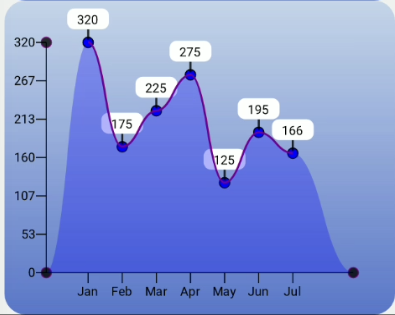
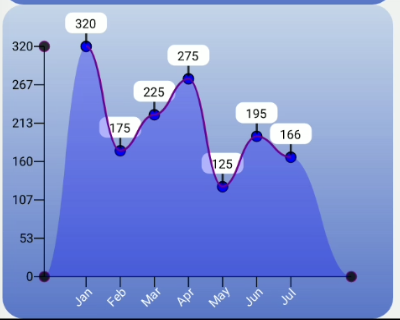

### Usage

The usage for all the charts is basically the same.

```js
import {LineChart} from '.react-native-c5';

<LineChart
  data={testData}
  x_key="month"
  y_key="value"
  height={300}
  margin={40}
  y_label_renderer={yRenderer}
/>
```

### Props

|    Prop name | optional | type | description | default |
| :----------: | :------: | :--: | :---------: | :---: |
| data         | [required] | array | array of data |
| x_key         | [required] | string | field to use for the x axis |
| y_key         | [required] | string | field to use for the Y axis |
| onPressItem   | [✔] | function | returns the item that was clicked |
|height | [✔] | number | height of the chart |
|width | [✔] | number | width of the chart |
|axisWidth | [✔] | number | width of axis lines | 2 |
|axisColor | [✔] | color | color of axis lines | #fff |
|axisCircleColor | [✔] | color | border circles of axis color | #fff |
|axisCircleRadius | [✔] | number | radius of border circles on the axis | 5 |
|curve | [✔] | boolean | use bezier curve for the chart line | true |
|lineCircleStroke | [✔] | color | chart line circle stroke color | #fff |
|lineCircleFill | [✔] | color | chart line circle color fill value | transparent |
|lineCircleStrokeWidth | [✔] | number | thickness of chart line circles | 2 |
|lineCircleRadius | [✔] | number | radius of chart line circles | 5 |
|lineStrokeWidth | [✔] | number | thickneess of chart line | 5 |
|lineStroke | [✔] | color | color of chart line | 'blue' |
|useLineShadow | [✔] | boolean | use gradient overlay under line chart | true |
|useBackgroundGradient | [✔] | boolean | use Background gradient for svg chart | true |
|verticalLines | [✔] | boolean | show Vertical lines | false |
|verticalLineOpacity | [✔] | number | opacity of vertical lines | 0.2 |
|horizontalLines | [✔] | boolean | show Horizontal lines | false |
|horizontalLineOpacity | [✔] | number | opacity of horizontal lines | 0.2 |
|showTooltips | [✔]  | boolean | show tooltips on chart | false |
|y_label_renderer| [✔] | function | function to custom render the y labels |
|x_label_renderer | [✔] | function | function to custom render the x labels |

### x_axis_label_config Props

|    Prop name | optional | type | description | default |
| :----------: | :------: | :--: | :---------: | :---: |
|rotation |  [✔] | number | degrees of rotation for labels | 0 |
|fontSize |  [✔] | number | font size of labels | 15 |
|fontColor |  [✔] | color | color of labels | '#fff' |
|textAnchor |  [✔] | string | anchor property of label | 'middle' |
|fontWeight |  [✔] | string | font weight of label | '400' |

### y_axis_label_config Props

|    Prop name | optional | type | description | default |
| :----------: | :------: | :--: | :---------: | :---: |
|rotation |  [✔] | number | degrees of rotation for labels | 0 |
|fontSize |  [✔] | number | font size of labels | 15 |
|fontColor |  [✔] | color | color of labels | '#fff' |
|textAnchor |  [✔] | string | anchor property of label | 'middle' |
|fontWeight |  [✔] | string | font weight of label | '400' |

### tooltip_config Props

|    Prop name | optional | type | description | default |
| :----------: | :------: | :--: | :---------: | :---: |
|tooltipHeight | [✔] | number | height of tooltips | 20 |
|tooltipWidth | [✔] | number | width of tooltips | 40 |
|tooltipFill | [✔] | color | background of tooltip | '#fff' |
|tooltipBorderRadius | [✔] | number | border radius of tooltips | 7 |
|fontSize | [✔] | number | fontSize for tooltip text | 12 |
|fontWeight | [✔] | string | font weight for tooltip text | '400' |
|textAnchor | [✔] | string | anchor point for text | 'middle' |

### line_fill_gradient_config Props

this config only has 2 props (stop1, stop2)

|    Prop name | optional | type | description | default |
| :----------: | :------: | :--: | :---------: | :---: |
|offset | [✔] | number | gradient offset | 0 |
|stopColor | [✔] | color | color for gradient point | |
|stopOpacity | [✔] | number | opacity for the gradient stop | |

### background_gradient_config Props

there are 4 stop points that can be configured the same as the line_fill_gradient_config stops

|    Prop name | optional | type | description | default |
| :----------: | :------: | :--: | :---------: | :---: |
|gradientUnits | [✔] | string | 'useSpaceOnUse' |
|x1 | [✔] | number | 0 |
|y1 | [✔] | number | 0 |
|x2 | [✔] | number | 0 |
|y2 | [✔] | number | 0 |

sample LineChart config that is available:

```js
const {
      onPressItem,
      height: containerHeight = 300,
      width: containerWidth = SCREEN_WIDTH - 50,
      backgroundColor = 'transparent',
      svgBackgroundColor = 'transparent',
      useGradientBackground = true,
      backgroundBorderRadius = 20,
      axisCircleRadius = 5,
      axisColor = '#000',
      axisCircleFillColor = '#000',
      axisCircleStrokeColor = 'purple',
      axisStrokeWidth = 1,
      axisCircleOpacity = 0.8,
      showHorizontalLines = false,
      horizontalLineOpacity = 0.1,
      showVerticalLines = false,
      verticalLineOpacity = 0.1,
      lineCircleRadius = 5,
      lineCircleStroke = '#000',
      lineCircleStrokeWidth = 1,
      lineCircleFill = 'blue',
      showTooltips = true,
      lineStrokeWidth = 2,
      lineStroke = 'purple',
      curve = true,
      useLineShadow = true,
      x_label_renderer,
      y_label_renderer,
      gradient_background_config = {
        x1: 0,
        y1: 0,
        x2: 0,
        y2: containerHeight,
        stop1: {
          offset: 0,
          stopColor: '#6491d9',
          stopOpacity: 0.3,
        },
        stop2: {
          offset: 1,
          stopColor: '#3557bf',
          stopOpacity: 0.8,
        },
      },
      x_axis_config = {
        fontSize: 12,
        textAnchor: 'middle',
        fontColor: '#fff',
        fontWeight: '400',
        rotation: -45,
      },
      y_axis_config = {
        fontSize: 12,
        textAnchor: 'end',
        fontColor: '#000',
        fontWeight: '400',
        rotation: 0,
      },
      tooltip_config = {
        tooltipHeight: 20,
        tooltipWidth: 40,
        tooltipFill: '#fff',
        tooltipBorderRadius: 7,
        fontSize: 12,
        fontWeight: '400',
        textAnchor: 'middle',
      },
    } = this.props;
```

## Bar Chart

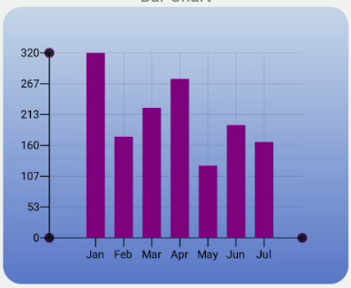
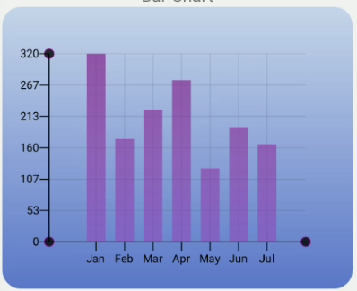
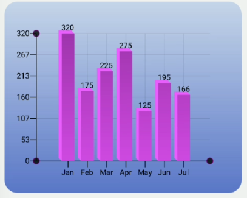

sample config for BarChart

```js
const {
      onPressItem,
      height: containerHeight = 300,
      width: containerWidth = SCREEN_WIDTH - 50,
      backgroundColor = 'transparent',
      svgBackgroundColor = 'transparent',
      backgroundBorderRadius = 20,
      axisCircleRadius = 5,
      axisColor = '#000',
      axisCircleFillColor = '#000',
      axisCircleStrokeColor = 'purple',
      axisStrokeWidth = 1,
      axisCircleOpacity = 0.8,
      showHorizontalLines = true,
      horizontalLineOpacity = 0.1,
      showVerticalLines = true,
      verticalLineOpacity = 0.1,
      useBarGradient = true,
      threeD = true,
      threeDX = 5,
      threeDY = 5,
      x_label_renderer,
      y_label_renderer,
      barColor = 'purple',
      barOpacity = 1,
      barWidth = 20,
      animated = true,
      gradient_background_config = {
        x1: 0,
        y1: 0,
        x2: 0,
        y2: containerHeight,
        stop1: {
          offset: 0,
          stopColor: '#6491d9',
          stopOpacity: 0.3,
        },
        stop2: {
          offset: 1,
          stopColor: '#3557bf',
          stopOpacity: 0.8,
        },
      },
      bar_gradient_config = {
        x1: 0,
        y1: 0,
        x2: 0,
        y2: containerHeight,
        stop1: {
          offset: 0,
          stopColor: '#7e248a',
          stopOpacity: 0.8,
        },
        stop2: {
          offset: 1,
          stopColor: '#b92bcc',
          stopOpacity: 0.3,
        },
      },
      x_axis_config = {
        fontSize: 12,
        textAnchor: 'middle',
        fontColor: '#000',
        fontWeight: '400',
        rotation: 0,
      },
      y_axis_config = {
        fontSize: 12,
        textAnchor: 'end',
        fontColor: '#000',
        fontWeight: '400',
        rotation: 0,
      },
      showTooltips = true,
      tooltip_config = {
        fontColor: '#000',
        fontSize: 12,
        fontWeight: '400',
        textAnchor: 'middle',
      },
    } = this.props;
```

## BoxPlot

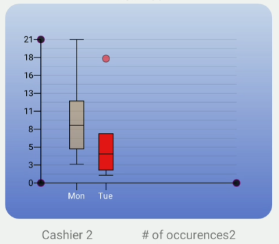

the boxplot chart also exposes some other useful helper functions

* asc
* desc
* sum
* max
* min
* range
* mean
* median
* quartile
* IQR
* Outliers
* maxWithoutOutliers
* minWithoutOutliers
* unique

```js
export interface BoxPlotPress<T> {
  record: string;
  q1: number;
  q3: number;
  index: number;
  x: number;
  m: number;
  outliers: number[];
  maxwo: number;
  minwo: number;
  dayData: any;
  predicateResult: T[] | null;
}

export interface BoxPlotProps<T> {
  barWidth?: number;
  animated?: boolean;
  barColor?: string;
  barOpacity?: number;
  bar_gradient_config?: ILinearGradient;
  predicate_gradient_config?: ILinearGradient;
  skipYAxisLabels?: number;
  barStroke?: string;
  barStrokeWidth?: number;
  useBarGradient?: boolean;
  medianStroke?: string;
  medianStrokeWidth?: number;
  upperLineStroke?: string;
  upperLineStrokeWidth?: number;
  upperboxStroke?: string;
  upperboxStrokeWidth?: number;
  lowerLineSroke?: string;
  lowerLineStrokeWidth?: number;
  lowerboxStroke?: string;
  lowerboxStrokeWidth?: number;
  onPress?: (record: BoxPlotPress<T>) => void;
  predicateResult?: (item: T) => T[] | [];
  outlier_config?: IOutlier;
}

export interface IOutlier {
  radius?: number;
  stroke?: string;
  strokeWidth?: number;
  opacity?: number;
  fill?: string;
}
```

## MultiLine

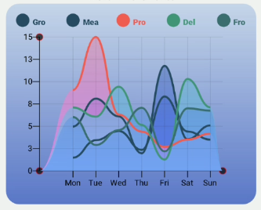

In order to use this chart, you have to separate your data. We have supplied a function that you can use for this:

```js
const colors = [
  '#81968f',
  '#ecb0e1',
  '#de6c83',
  '#c1aac0',
  '#2cf6b3',
  '#87255b',
];

const separated = separateData(promarData, 'f01', colors);
```

here we are creating each array based off the 'f01' key of the data specified. Each of these arrays will become each line.

## Contributing

See the [contributing guide](CONTRIBUTING.md) to learn how to contribute to the repository and the development workflow.

## License

MIT

---

Made with [create-react-native-library](https://github.com/callstack/react-native-builder-bob)

### shoutouts

[make jest woth with Animated](https://medium.com/@joncardasis/react-native-how-to-test-components-implementing-animated-with-jest-8cabb5fc2730)