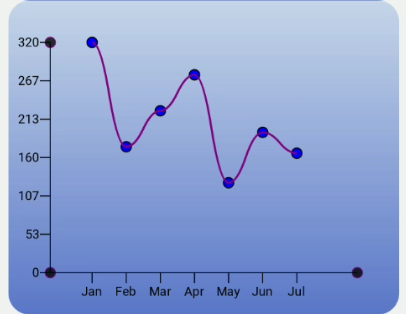

# react-native-c5

a  small library to host charts

## Installation

```sh
npm install react-native-c5
```

## Basic Chart


## Line Chart




### Usage

```js
import {LineChart} from '.react-native-c5';

<LineChart
  data={testData}
  x_key="month"
  y_key="value"
  height={300}
  margin={40}
  y_label_renderer={yRenderer}
/>
```

sample LineChart config that is available:

```js
const {
      onPressItem,
      height: containerHeight = 300,
      width: containerWidth = SCREEN_WIDTH - 50,
      backgroundColor = 'transparent',
      svgBackgroundColor = 'transparent',
      useGradientBackground = true,
      backgroundBorderRadius = 20,
      axisCircleRadius = 5,
      axisColor = '#000',
      axisCircleFillColor = '#000',
      axisCircleStrokeColor = 'purple',
      axisStrokeWidth = 1,
      axisCircleOpacity = 0.8,
      showHorizontalLines = false,
      horizontalLineOpacity = 0.1,
      showVerticalLines = false,
      verticalLineOpacity = 0.1,
      lineCircleRadius = 5,
      lineCircleStroke = '#000',
      lineCircleStrokeWidth = 1,
      lineCircleFill = 'blue',
      showTooltips = true,
      lineStrokeWidth = 2,
      lineStroke = 'purple',
      curve = true,
      useLineShadow = true,
      x_label_renderer,
      y_label_renderer,
      gradient_background_config = {
        x1: 0,
        y1: 0,
        x2: 0,
        y2: containerHeight,
        stop1: {
          offset: 0,
          stopColor: '#6491d9',
          stopOpacity: 0.3,
        },
        stop2: {
          offset: 1,
          stopColor: '#3557bf',
          stopOpacity: 0.8,
        },
      },
      x_axis_config = {
        fontSize: 12,
        textAnchor: 'middle',
        fontColor: '#fff',
        fontWeight: '400',
        rotation: -45,
      },
      y_axis_config = {
        fontSize: 12,
        textAnchor: 'end',
        fontColor: '#000',
        fontWeight: '400',
        rotation: 0,
      },
      tooltip_config = {
        tooltipHeight: 20,
        tooltipWidth: 40,
        tooltipFill: '#fff',
        tooltipBorderRadius: 7,
        fontSize: 12,
        fontWeight: '400',
        textAnchor: 'middle',
      },
    } = this.props;
```

## Contributing

See the [contributing guide](CONTRIBUTING.md) to learn how to contribute to the repository and the development workflow.

## License

MIT

---

Made with [create-react-native-library](https://github.com/callstack/react-native-builder-bob)
